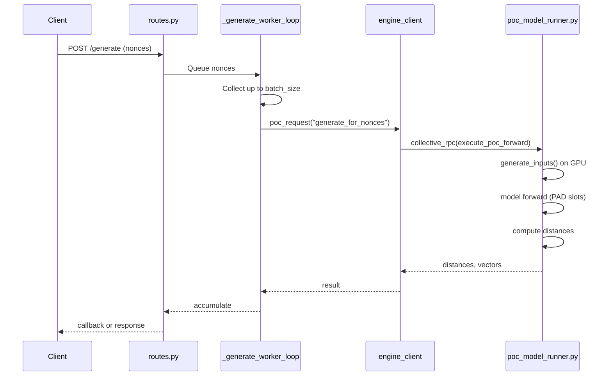
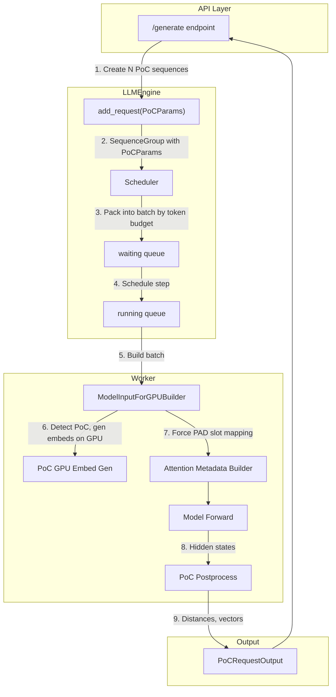

# PoC as First-Class Scheduled Request in vLLM V0 Generate Engine

## Design Proposal

---

## 1. Problem Statement

The current PoC `/api/v1/pow/generate` endpoint:
- Has its **own batching loop** (`_generate_worker_loop` in `vllm/poc/routes.py`) that manually collects nonces up to a user-specified `batch_size`.
- Calls `engine_client.poc_request("generate_for_nonces", ...)` which runs a **direct `collective_rpc`** forward, bypassing vLLM's scheduler entirely.
- Does not participate in vLLM's token budget (`max_num_batched_tokens`) or sequence limits (`max_num_seqs`).
- Cannot automatically yield to interactive `/chat/completions` under load.

### Goals
1. **Dynamic batching**: PoC should use vLLM's scheduler to automatically batch "as many nonces as possible" within the token budget.
2. **Priority-based yielding**: Under concurrent chat load, PoC should yield GPU time to chat via priority scheduling.
3. **GPU-side input generation**: PoC embeddings must be generated directly on GPU from compact metadata (hash, pubkey, nonces, seq_len)—no large CPU→GPU tensor transfers.
4. **No KV cache consumption**: PoC is prefill-only; it must not allocate or write to KV cache.
5. **PP/TP compatibility**: Must work with pipeline-parallel and tensor-parallel execution.
6. **Single engine**: PoC and chat share the same `runner_type="generate"` engine process.

---

## 2. Current State

### 2.1 Existing PoC Data Flow



### 2.2 Why It Bypasses Scheduler
The `poc_request` path in `AsyncLLMEngine.poc_request()` directly invokes `PoCManager.generate_for_nonces()`, which calls `collective_rpc(execute_poc_forward, ...)`. This goes straight to workers without entering the scheduler's waiting queue.

### 2.3 Key PoC Properties to Preserve
From `vllm/poc/poc_model_runner.py`:
- **GPU input generation**: `generate_inputs(block_hash, public_key, nonces, dim, seq_len, device, dtype)` creates embeddings on GPU.
- **No KV writes**: Attention metadata uses `slot_mapping = PAD_SLOT_ID` for all tokens.
- **Prefill-only**: Single forward pass, no decode loop.
- **PP-aware**: Only last PP rank computes distances and returns results.

---

## 3. Proposed Architecture

### 3.1 High-Level Design



### 3.2 New Types

#### 3.2.1 `PoCParams` (new)
A new parameter type parallel to `SamplingParams` and `PoolingParams`:

```python
# vllm/poc/poc_params.py
@dataclass
class PoCParams:
    """Parameters for a PoC (Proof of Compute) request."""
    block_hash: str
    public_key: str
    block_height: int
    nonce: int              # Single nonce per sequence
    r_target: float
    seq_len: int = 256
    return_vectors: bool = False
    
    def clone(self) -> "PoCParams":
        return PoCParams(
            block_hash=self.block_hash,
            public_key=self.public_key,
            block_height=self.block_height,
            nonce=self.nonce,
            r_target=self.r_target,
            seq_len=self.seq_len,
            return_vectors=self.return_vectors,
        )
```

#### 3.2.2 `PoCRequestOutput` (new)
A new output type parallel to `RequestOutput` and `PoolingRequestOutput`:

```python
# vllm/outputs.py (extend)
@dataclass
class PoCOutput:
    nonce: int
    distance: float
    vector: Optional[list[float]] = None

class PoCRequestOutput:
    def __init__(self, request_id: str, output: PoCOutput, finished: bool):
        self.request_id = request_id
        self.outputs = output
        self.finished = finished
```

### 3.3 Request Ingestion

Extend `LLMEngine.add_request()` to accept `PoCParams`:

```python
# vllm/engine/llm_engine.py
def add_request(
    self,
    request_id: str,
    prompt: PromptType,
    params: Union[SamplingParams, PoolingParams, PoCParams],  # Extended
    ...
):
    ...
    if isinstance(params, PoCParams):
        seq_group = self._create_sequence_group_with_poc(
            request_id, seq, params, arrival_time, priority
        )
    ...
```

For PoC, the "prompt" is a dummy token list of length `seq_len`:
```python
prompt = {"prompt_token_ids": [0] * poc_params.seq_len}
```
No tokenization needed. The actual embeddings will be generated on GPU.

### 3.4 Scheduling Model

#### 3.4.1 One Sequence Per Nonce
Each nonce becomes a separate `SequenceGroup` with one `Sequence`. This allows the scheduler to:
- Pack multiple PoC sequences into a batch until `token_budget` is exhausted.
- Apply per-sequence fairness and priority.
- Naturally interleave with chat sequences when budget allows.

#### 3.4.2 Token Cost
A PoC sequence costs `seq_len` tokens (prefill tokens). The scheduler's `SchedulingBudget.can_schedule()` already accounts for `num_new_tokens`, so PoC sequences compete fairly with chat prefills.

#### 3.4.3 Priority Scheduling
With `scheduler_config.policy = "priority"`:
- Chat requests: `priority = 0` (highest)
- PoC requests: `priority = 1` (lower)

The scheduler's `_get_priority()` returns `(priority, arrival_time)`, so PoC will only be scheduled when:
1. There's remaining token budget after scheduling higher-priority requests, OR
2. No higher-priority requests are waiting.

Priority preemption (`_schedule_priority_preemption`) can preempt running PoC to make room for chat.

### 3.5 Block Manager Bypass for PoC

#### 3.5.1 The Problem
The normal block manager (`SelfAttnBlockSpaceManager`) allocates KV cache blocks for sequences. PoC doesn't need KV cache.

#### 3.5.2 Options

**Option A: Per-Sequence Block Manager Override (Recommended)**

Add a flag to `SequenceGroup` indicating it should bypass block allocation:

```python
# In SequenceGroup
self.skip_kv_cache: bool = isinstance(params, PoCParams)
```

Modify scheduler's block allocation check:

```python
# In Scheduler._schedule_prefills()
if seq_group.skip_kv_cache:
    can_allocate = AllocStatus.OK
else:
    can_allocate = self.block_manager.can_allocate(seq_group)
```

And skip actual allocation:

```python
# In Scheduler._allocate_and_set_running()
if not seq_group.skip_kv_cache:
    self.block_manager.allocate(seq_group)
```

**Option B: Hybrid Block Manager**

Create a `HybridBlockSpaceManager` that delegates to `PlaceholderBlockSpaceManager` for PoC sequences and `SelfAttnBlockSpaceManager` for others. This is more complex but cleaner separation.

**Recommendation**: Option A is simpler and sufficient.

### 3.6 Attention Metadata: Force PAD Slot Mapping

#### 3.6.1 Current Behavior
In `vllm/attention/backends/utils.py`, `compute_slot_mapping()` fills `PAD_SLOT_ID` when `is_profile_run` (block tables empty):

```python
def compute_slot_mapping(is_profile_run: bool, slot_mapping: List[int], ...):
    if is_profile_run:
        slot_mapping.extend([PAD_SLOT_ID] * seq_len)
        return
```

#### 3.6.2 Proposed Change
Add PoC detection to the attention metadata builder. In `InterDataForSeqGroup` (or via `SequenceGroupMetadata`), propagate a `disable_kv_cache` flag:

```python
# In ModelInputForGPUBuilder._compute_lens() or _add_seq_group()
if seq_group_metadata.poc_params is not None:
    inter_data.disable_kv_cache = True
```

Then in the attention metadata builder (e.g., `FlashInferMetadataBuilder._add_seq_group`):

```python
if inter_data.disable_kv_cache:
    self.slot_mapping.extend([PAD_SLOT_ID] * token_len)
    self.block_tables.append([])
    return  # Skip paged-KV tensor updates
```

This mirrors the profile-run behavior but for PoC sequences.

### 3.7 GPU-Side Input Generation

#### 3.7.1 Current Worker Flow
In `ModelInputForGPUBuilder._compute_lens()`:

```python
if seq_data.prompt_embeds is None:
    tokens = seq_data.get_token_ids()[context_len:seq_len]
    prompt_embeds = None
else:
    tokens = [0] * (seq_len - context_len)
    prompt_embeds = seq_data.get_token_embeddings()[context_len:seq_len]

inter_data.inputs_embeds = prompt_embeds
```

#### 3.7.2 Proposed PoC Path
Add a third branch for PoC:

```python
if seq_group_metadata.poc_params is not None:
    # PoC: Mark for GPU generation later (in batch)
    tokens = [0] * (seq_len - context_len)
    inter_data.poc_params = seq_group_metadata.poc_params
    inter_data.inputs_embeds = None  # Will be generated on GPU
elif seq_data.prompt_embeds is None:
    ...
else:
    ...
```

Then in `ModelInputForGPUBuilder.build()`, after collecting all `inter_data_list`, generate PoC embeddings on GPU in a batched fashion:

```python
def _generate_poc_embeddings(self, inter_data_list) -> Optional[torch.Tensor]:
    """Generate embeddings for PoC sequences directly on GPU."""
    poc_items = [(i, d) for i, d in enumerate(inter_data_list) if d.poc_params is not None]
    if not poc_items:
        return None
    
    # Collect PoC metadata
    indices = [i for i, _ in poc_items]
    params_list = [d.poc_params for _, d in poc_items]
    
    # Call existing GPU generation logic
    from vllm.poc.gpu_random import generate_inputs
    
    block_hash = params_list[0].block_hash  # Same for batch
    public_key = params_list[0].public_key
    nonces = [p.nonce for p in params_list]
    seq_len = params_list[0].seq_len
    hidden_size = self.runner.model_config.get_hidden_size()
    
    embeddings = generate_inputs(
        block_hash, public_key, nonces,
        dim=hidden_size, seq_len=seq_len,
        device=self.runner.device,
        dtype=self.runner.model_config.dtype,
    )
    
    return embeddings, indices
```

This embeddings tensor is then assigned to the appropriate positions in `inputs_embeds` before model execution.

### 3.8 Execution Path

#### 3.8.1 Prefill-Only, No Decode
PoC sequences should be marked finished immediately after prefill:

```python
# In SequenceGroup or Sequence
if self.poc_params is not None:
    # After first forward, mark finished
    self.status = SequenceStatus.FINISHED_STOPPED
```

The scheduler should recognize PoC sequences never enter decode phase.

#### 3.8.2 PoC Postprocessing on Last PP Rank
After the model forward, on the last PP rank, detect PoC sequences and compute distances:

```python
# In ModelRunner.execute_model() or a hook
if poc_sequences_in_batch:
    hidden_states = ...  # From forward output
    # Extract last token hidden states for PoC sequences
    # Compute distances using existing PoC logic:
    # - random_pick_indices()
    # - generate_haar_orthogonal_matrices()
    # - generate_target()
    # - normalize and compute L2 distance
```

This logic already exists in `vllm/poc/poc_model_runner.py` lines 226-248.

#### 3.8.3 Output Path
After postprocessing, create `PoCRequestOutput` objects and route them through the normal output path (similar to how `PoolingRequestOutput` is created in `RequestOutputFactory`).

### 3.9 API Surface Changes

#### 3.9.1 `/generate` Endpoint Changes
The endpoint creates N PoC requests (one per nonce) and enqueues them:

```python
@router.post("/generate")
async def generate_nonces(request: Request, body: PoCGenerateRequest):
    engine_client = await get_engine_client(request)
    
    request_ids = []
    for nonce in body.nonces:
        request_id = f"poc-{uuid.uuid4()}"
        poc_params = PoCParams(
            block_hash=body.block_hash,
            public_key=body.public_key,
            block_height=body.block_height,
            nonce=nonce,
            r_target=body.r_target,
            seq_len=body.seq_len,
            return_vectors=body.return_vectors,
        )
        
        # Enqueue as normal scheduled request with lower priority
        await engine_client.add_request(
            request_id=request_id,
            prompt={"prompt_token_ids": [0] * body.seq_len},
            params=poc_params,
            priority=1,  # Lower than chat (0)
        )
        request_ids.append(request_id)
    
    if body.wait:
        # Collect all results
        results = await collect_poc_results(engine_client, request_ids)
        return {"status": "completed", "results": results}
    else:
        return {"status": "queued", "request_ids": request_ids}
```

#### 3.9.2 Callback Mode
For callback mode, the endpoint can spawn a background task that awaits the result generators and periodically batches results to the callback URL.

---

## 4. SequenceGroupMetadata Extension

Add PoC params to the metadata structure that's passed to workers:

```python
# vllm/sequence.py
class SequenceGroupMetadata(msgspec.Struct, ...):
    ...
    pooling_params: Optional[PoolingParams] = None
    poc_params: Optional[PoCParams] = None  # NEW
    ...
```

The scheduler populates this when building `SequenceGroupMetadata` for a step.

---

## 5. Data Flow Diagram

```mermaid
flowchart LR
    subgraph request [Request Phase]
        A["POST /generate<br/>N nonces"] --> B["Create N SequenceGroups<br/>with PoCParams"]
        B --> C["add_request() x N<br/>priority=1"]
    end

    subgraph schedule [Scheduler Phase]
        C --> D["waiting queue"]
        D --> E{"Budget<br/>available?"}
        E -->|Yes| F["Schedule PoC sequences"]
        E -->|No, chat waiting| G["Schedule chat first"]
        G --> E
        F --> H["Build SequenceGroupMetadata<br/>with poc_params"]
    end

    subgraph worker [Worker Phase]
        H --> I["ModelInputForGPUBuilder"]
        I --> J{"PoC<br/>sequence?"}
        J -->|Yes| K["Set disable_kv_cache=True"]
        J -->|No| L["Normal token/embed handling"]
        K --> M["generate_inputs() on GPU"]
        M --> N["Attention metadata<br/>slot_mapping=PAD_SLOT_ID"]
        L --> N
        N --> O["Model Forward"]
        O --> P{"Last<br/>PP rank?"}
        P -->|Yes, PoC| Q["Compute distances"]
        P -->|Yes, chat| R["Sample next token"]
        P -->|No| S["Send intermediate<br/>tensors to next rank"]
        Q --> T["PoCRequestOutput"]
        R --> U["CompletionOutput"]
    end

    subgraph output [Output Phase]
        T --> V["Route to /generate response"]
        U --> W["Route to /chat response"]
    end
```



---

## 6. Correctness Considerations

### 6.1 Memory Accounting
PoC sequences don't allocate KV blocks, but the scheduler still counts their tokens toward `token_budget`. This is correct because:
- PoC tokens consume activation memory during forward.
- Token budget reflects compute capacity, not just memory.

### 6.2 Block Manager Consistency
With `skip_kv_cache=True`:
- `can_allocate()` returns `AllocStatus.OK` unconditionally.
- `allocate()` is skipped.
- `free()` is a no-op.
- `get_block_table()` returns empty/None.

This maintains block manager invariants.

### 6.3 Chunked Prefill
If chunked prefill is enabled, PoC sequences should **not** be chunked (they're prefill-only and we want them done in one forward). Set a flag or check:

```python
if seq_group.poc_params is not None:
    token_chunk_size = seq_len  # Full prefill
```

### 6.4 Prefix Caching
PoC sequences have no meaningful tokens to cache. Ensure prefix caching logic skips PoC:

```python
if seq_group.skip_kv_cache:
    computed_block_nums = []
```

### 6.5 Speculative Decoding
PoC doesn't decode, so speculative decoding doesn't apply. No special handling needed.

---

## 7. Performance Considerations

### 7.1 Batching Efficiency
With scheduler integration:
- PoC sequences are batched to fill `max_num_batched_tokens`.
- No manual `batch_size` tuning needed.
- Automatic adaptation to available capacity.

### 7.2 GPU Utilization
- PoC embeddings generated on GPU avoid CPU→GPU transfer bottleneck.
- Batched embedding generation is efficient.

### 7.3 Priority Overhead
Priority scheduling adds minimal overhead (sorting by priority, occasional preemption). The benefit of automatic yielding outweighs this.

### 7.4 Mixed Batches
Batches may contain both chat prefills and PoC sequences. This is fine:
- They share the same attention kernels.
- PoC uses PAD slots; chat uses real slots.
- Outputs are routed separately.

---

## 8. Rollout Plan

### 8.1 Feature Flag
Add an environment variable:

```python
VLLM_POC_SCHEDULER_INTEGRATION = os.getenv("VLLM_POC_SCHEDULER_INTEGRATION", "0") == "1"
```

When disabled, fall back to existing `poc_request` path.

### 8.2 Incremental Implementation

**Phase 1: Core Types**
- Add `PoCParams` and `PoCRequestOutput`.
- Extend `LLMEngine.add_request()` to accept `PoCParams`.
- Add `skip_kv_cache` flag to `SequenceGroup`.

**Phase 2: Scheduler Integration**
- Modify scheduler to handle `skip_kv_cache` sequences.
- Test scheduling with mixed chat + PoC load.

**Phase 3: Worker Integration**
- Add `poc_params` to `SequenceGroupMetadata`.
- Implement GPU embedding generation in worker.
- Implement PAD slot mapping for PoC.

**Phase 4: Postprocessing**
- Implement PoC distance computation in execute_model.
- Create `PoCRequestOutput` objects.
- Route outputs correctly.

**Phase 5: API Integration**
- Update `/generate` endpoint to use new path.
- Implement callback aggregation.

### 8.3 Testing

#### Unit Tests
- PoC sequence scheduling with budget limits.
- PAD slot mapping for PoC sequences.
- GPU embedding generation.

#### Integration Tests
- Mixed chat + PoC workload.
- Priority preemption under load.
- PP/TP execution.

#### Performance Validation
- Compare throughput vs current PoC path.
- Measure chat latency impact under PoC load.
- Verify GPU memory behavior (no KV cache growth for PoC).

### 8.4 Metrics
Add observability:
- `vllm:poc_sequences_scheduled` counter
- `vllm:poc_sequences_preempted` counter (if chat preempts PoC)
- `vllm:poc_batch_size` histogram
- `vllm:poc_latency_ms` histogram

### 8.5 PP/TP Specific Validation

#### Pipeline Parallel (PP)
- **Intermediate tensor routing**: Verify that PoC sequences correctly send/receive intermediate tensors between PP ranks using the existing `IntermediateTensors` mechanism.
- **Last-rank postprocessing**: Confirm that PoC distance computation only happens on `pp_group.is_last_rank`.
- **Mixed batch handling**: Test batches containing both chat prefills and PoC sequences across PP stages.

#### Tensor Parallel (TP)
- **TP sync**: PoC uses `broadcast_tensor_dict` for metadata sync (existing in `poc_model_runner.py`). Verify this integrates with the scheduled path.
- **Embedding generation**: Ensure `generate_inputs()` produces identical embeddings on all TP ranks (deterministic based on nonces).
- **Attention**: PAD slot mapping should work identically across TP ranks.

#### Test Matrix
| Configuration | Test Case |
|---------------|-----------|
| TP=1, PP=1 | Basic PoC scheduling |
| TP=4, PP=1 | PoC + chat mixed batch |
| TP=1, PP=2 | PoC intermediate tensor routing |
| TP=2, PP=2 | Full distributed test |
| Any | Priority preemption under load |
| Any | Memory stability (no KV growth for PoC) |

### 8.6 Fallback Path
If `VLLM_POC_SCHEDULER_INTEGRATION=0` (default initially):
- `/generate` uses the existing `poc_request("generate_for_nonces", ...)` path.
- No scheduler integration, manual batch size control.
- Allows safe rollback if issues arise.

---

## 9. Files to Modify

| File | Changes |
|------|---------|
| `vllm/poc/poc_params.py` | New file: `PoCParams` class |
| `vllm/outputs.py` | Add `PoCOutput`, `PoCRequestOutput` |
| `vllm/sequence.py` | Add `skip_kv_cache` to `SequenceGroup`, `poc_params` to `SequenceGroupMetadata` |
| `vllm/engine/llm_engine.py` | Extend `add_request()` for `PoCParams`, add `_create_sequence_group_with_poc()` |
| `vllm/engine/async_llm_engine.py` | Propagate PoC support to async interface |
| `vllm/core/scheduler.py` | Handle `skip_kv_cache` in allocation logic |
| `vllm/worker/model_runner.py` | Add PoC embedding generation, propagate `disable_kv_cache` |
| `vllm/attention/backends/utils.py` | Handle `disable_kv_cache` in slot mapping |
| `vllm/attention/backends/flashinfer.py` | Handle `disable_kv_cache` in builder |
| `vllm/attention/backends/flash_attn.py` | Handle `disable_kv_cache` in builder |
| `vllm/poc/routes.py` | Update `/generate` to use scheduler path |

---

## 10. Verified Code Paths

The following code paths have been verified as realistic integration points:

### 10.1 Scheduler Allocation Bypass
In `vllm/core/scheduler.py`, method `_schedule_prefills()` at line ~1126:
```python
can_allocate = self.block_manager.can_allocate(seq_group, num_lookahead_slots=num_lookahead_slots)
```
For PoC sequences with `skip_kv_cache=True`, this should return `AllocStatus.OK` unconditionally.

In `_allocate_and_set_running()` at line ~1731:
```python
self.block_manager.allocate(seq_group)
```
This call should be skipped for `skip_kv_cache=True` sequences.

### 10.2 Worker Input Building
In `vllm/worker/model_runner.py`, method `ModelInputForGPUBuilder.build()` at line ~867:
```python
for inter_data in self.inter_data_list:
    ...
    if inter_data.inputs_embeds is not None:
        inputs_embeds_list.append(inter_data.inputs_embeds.to(...))
```
PoC embeddings generated on GPU would be assigned to `inter_data.inputs_embeds` during the input building phase.

### 10.3 Output Routing
In `vllm/outputs.py`, `RequestOutputFactory.create()` at line ~396:
```python
if seq_group.pooled_data is not None:
    return PoolingRequestOutput.from_seq_group(seq_group)
else:
    return RequestOutput.from_seq_group(...)
```
For PoC, add a similar check for `poc_data`:
```python
if seq_group.poc_data is not None:
    return PoCRequestOutput.from_seq_group(seq_group)
elif seq_group.pooled_data is not None:
    ...
```

### 10.4 Attention Metadata - PAD Slot Mapping
In `vllm/attention/backends/utils.py`, `compute_slot_mapping()` at line ~86:
```python
if is_profile_run:
    slot_mapping.extend([PAD_SLOT_ID] * seq_len)
    return
```
The same pattern applies for PoC with `disable_kv_cache=True`.

---

## 11. Open Questions

1. **Chunked prefill for very long PoC seq_len?**
   - Current PoC uses seq_len up to ~3000. If this exceeds typical chunked prefill thresholds, should PoC be exempt from chunking, or chunked normally?
   - Recommendation: Exempt from chunking since PoC is prefill-only.

2. **Async generator interface?**
   - Chat uses async generators for streaming. PoC is single-shot. Should `/generate` return a generator for consistency, or is simple request/response OK?
   - Recommendation: Support both `wait=True` (blocking) and callback modes. No streaming needed.

3. **Rate limiting?**
   - Should there be a limit on concurrent PoC sequences to prevent starvation of block manager for chat?
   - Recommendation: Priority scheduling handles this. If needed, add a separate `max_poc_seqs` config.

---

## 12. Summary

This design integrates PoC into vLLM's V0 scheduler as a first-class request type, achieving:

- ✅ **Dynamic batching**: Scheduler packs PoC to token budget automatically.
- ✅ **Priority yielding**: PoC at priority=1 yields to chat at priority=0.
- ✅ **GPU-side inputs**: Embeddings generated on GPU, no CPU→GPU transfer.
- ✅ **No KV cache**: `skip_kv_cache` flag bypasses block allocation; PAD slot mapping avoids writes.
- ✅ **PP/TP compatible**: Uses standard engine execution path.
- ✅ **Single engine**: No separate process or model instance.

The implementation is incremental and can be rolled out behind a feature flag with fallback to the existing path.

